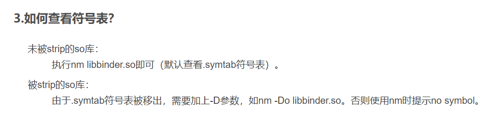
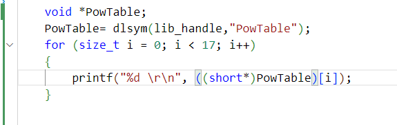
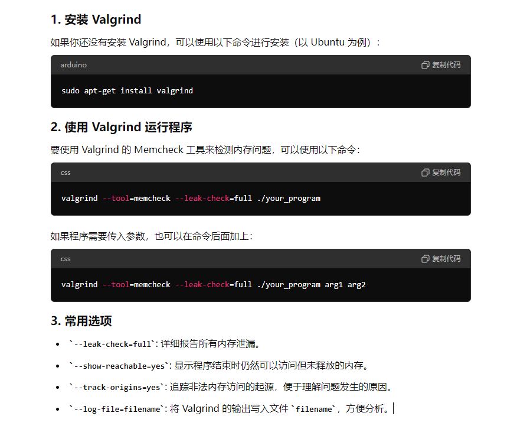

# 嵌入式linux命令

#### 软链接

ln -s \[目标文件或目录的绝对路径\] \[快捷方式的存放路径\]

shred 销毁/覆盖命令

ldd "List Dynamic Dependencies"（列出动态依赖项）

fpic "function-level Position Independent Code

gcc main.c -o Test -L./ -lMyTest -ldl （-ldl是告诉编译器在链接时要包含动态链接库的选项，也就是#include <dlfcn.h>）

gcc example.c -o AvocTest -L./ -lceshi -ldl -lm

gcc example.c -o AvocTest -L./ -ldl -lm

valgrind --tool=memcheck ./AvocTest

gdb命令调试

```bash
file libceshi.so 查看库是多少位的
```

**rk3568_linux_sdk**

#### 1、SDK结构
