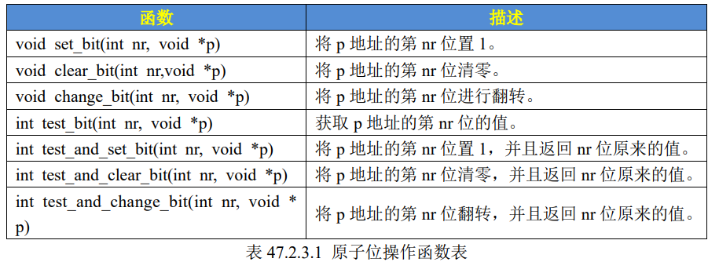

# LINUX 并发与竞争

## 一、并发产生的原因

1. **多线程并发访问**：Linux 是多任务（线程）系统，多线程访问是最基本的原因
2. **抢占式并发访问**：从 2.6 版本内核开始，Linux 支持抢占，调度程序可以在任意时刻抢占正在运行的线程
3. **中断程序并发访问**：硬件中断的优先级很高
4. **SMP（多核）核间并发访问**：多核 CPU 存在核间并发访问

---

## 二、原子操作

### 实现原理

Linux 的原子操作是通过 **LDAXR 与 STXR** 以及 **cache 一致性**实现的。两个 CPU 同时抢锁时，某一个会 STXR 失败。

> 不是靠 C 语言，也不是靠 Linux 的普通软件代码，而是靠 CPU 架构提供的原子/独占内存访问机制，以及多核缓存一致性硬件来实现。

STXR 可以理解成："如果从 CPUx 开始 LDAXR 之后，这个位置没有被其他人破坏 CPUx 独占条件，那 CPUx 就把数据写进去。"

### 自旋锁的原子操作流程

```
spin_lock()
    ↓
  LDAXR
    ↓
建立独占监视
    ↓
  STXR
    ↓
  ┌───┴───┐
  ↓       ↓
成功     失败
  ↓       ↓
获得锁  exclusive 失效
  ↓       ↓
进入临界区  重新 LDAXR
            ↓
           STXR
            ↓
           循环
```

### 原子整形操作 API

```c
#include <asm/atomic.h>

atomic_t my_atomic;
atomic_set(&my_atomic, 0);
atomic_inc(&my_atomic);          /* 原子加 1 */
atomic_dec(&my_atomic);          /* 原子减 1 */
atomic_add(5, &my_atomic);       /* v += 5，原子加 */
atomic_sub(3, &my_atomic);       /* v -= 3，原子减 */
atomic_read(&my_atomic);         /* 原子读 */
atomic_set(&my_atomic, 10);      /* 原子写 */
```

```c
typedef struct {
    int counter;
} atomic_t;
```

> 注意：此写法为固定的 Linux 接口格式。结构体命名必须是 `atomic_t`，结构体内只能有一个 32 位类型的数据。

### 原子位操作



---

## 三、自旋锁

### 基本概念

当一个线程要访问某个共享资源时，首先要获取相应的锁。锁只能被一个线程持有，只要此线程不释放持有的锁，其他线程就不能获取此锁。

对于自旋锁而言，如果锁正在被线程 A 持有，线程 B 想要获取锁，那么线程 B 就会处于**忙循环-旋转-等待**状态，不会进入休眠。

> 比如公用电话亭，一次只能进去一个人。里面有人时，你只能站在原地等待（转圈圈），哪里也不能去，直到里面的人出来。

### API

```c
#include <linux/spinlock.h>

spinlock_t lock;
spin_lock_init(&lock);

unsigned long flags;
spin_lock_irqsave(&lock, flags);    /* 上锁 */
/* 临界区 */
spin_unlock_irqrestore(&lock, flags); /* 解锁 */
```

宏展开：

```c
#define spin_lock_irqsave(lock, flags) \
    do {                                \
        flags = 保存当前中断状态;       \
        spin_lock(lock);                \
    } while (0)

#define spin_unlock_irqrestore(lock, flags) \
    do {                                        \
        spin_unlock(lock);                      \
        local_irq_restore(flags);               \
    } while (0)
```

### 自旋锁死锁

自旋锁会自动禁止抢占。如果线程 A 在持有锁期间进入休眠，线程 A 放弃 CPU，线程 B 开始运行并想要获取锁，但锁被 A 持有且内核抢占被禁止，线程 B 无法被调度出去，线程 A 无法运行，锁无法释放 → **死锁**。

### 注意事项

1. 锁的持有时间不能太长，一定要短，否则降低系统性能。临界区大时选择其他并发方式
2. 临界区内不能调用任何可能导致线程休眠的 API 函数，否则可能死锁
3. 不能递归申请自旋锁，否则自己把自己锁死
4. 编写驱动时必须考虑可移植性，不管单核还是多核 SOC，都当做多核来写

---

## 四、信号量

```c
#include <linux/semaphore.h>

struct semaphore sem;
sema_init(&sem, 1);

down_interruptible(&sem);   /* 获取信号量（可中断） */
up(&sem);                   /* 释放信号量 */
```

---

## 五、互斥锁

```c
#include <linux/mutex.h>

struct mutex mutex;
mutex_init(&mutex);

mutex_lock_interruptible(&mutex);   /* 上锁 */
mutex_unlock(&mutex);               /* 解锁 */
```

互斥锁（mutex）和自旋锁最大的区别：获取不到锁时，线程是否继续占用 CPU 等待。mutex 获取失败后，不会死循环，而是把自己挂起进入睡眠模式。

---

## 六、对比总结

| 机制 | 解决范围 | 等待方式 | 适用场景 |
|------|---------|---------|---------|
| 原子操作 | 一个变量的竞争 | 无等待 | 计数器、标志位 |
| 自旋锁 | 一段逻辑的竞争 | 站着等（占 CPU） | 短临界区、中断上下文 |
| 互斥锁 | 一段逻辑的竞争 | 坐下等（睡眠） | 长临界区、进程上下文 |
| 信号量 | 一段逻辑的竞争 | 坐下等（睡眠） | 可计数的资源保护 |

> `interruptible` 在 Linux 内核里更准确地理解为：等待某个资源时，可以被信号（signal）打断。
