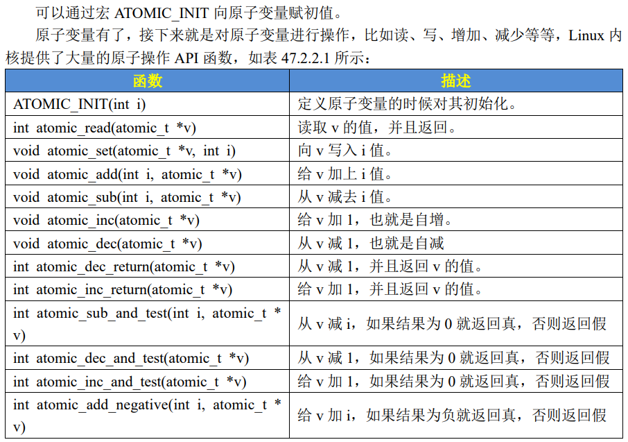
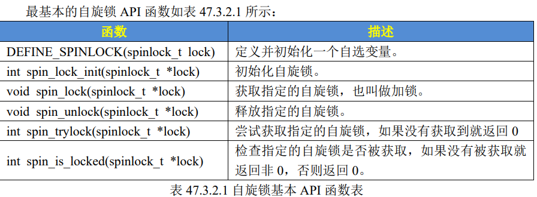
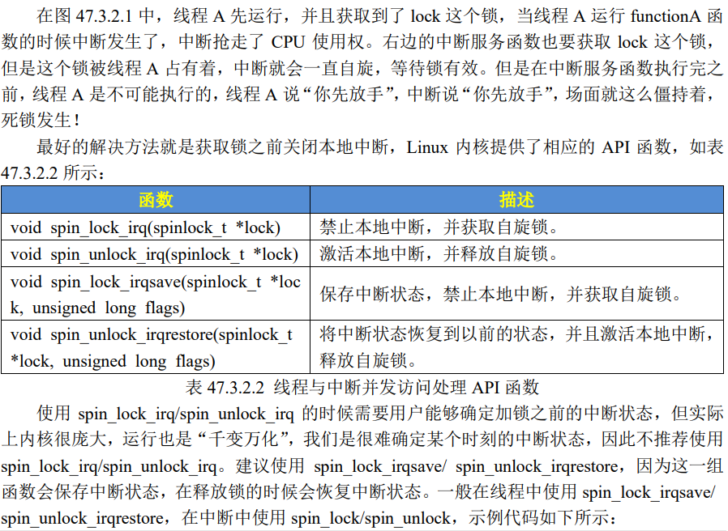

# LINUX并发与竞争

#### 原子操作是怎么实现的**

#### linux的原子操作是通过LDAXR与STXR以及cache一致性实现的。两个cpu同时抢锁的时候，某一个会STXR失败。

#### 不是靠 C 语言，也不是靠 Linux 的普通软件代码，而是靠 CPU 架构提供的原子/独占内存访问机制，以及多核缓存一致性硬件来实现。

STXR可以理解成"如果从cpux开始 LDAXR 之后，这个位置没有被其他人破坏这个cpux独占条件，那cpux就把数据写进去。此时进入竞争。

```c
        spin_lock()
```

             ↓
          LDAXR
             ↓
     建立独占监视
             ↓
          STXR
             ↓
```text
       ┌─────┴─────┐
```
       ↓           ↓
     成功          失败
       ↓           ↓
   获得锁       exclusive失效
       ↓           ↓
进入临界区      重新 LDAXR
                   ↓
                STXR
                   ↓
                 循环

#### 名词解释

#### "临界"（critical）

-   英*/*ˈkrɪtɪk(ə)l*/*
-   美*/*ˈkrɪtɪk(ə)l*/*
-   adj. 批判的，爱挑剔的；极其重要的，关键的；严重的，危急的；病重的，重伤的；评论性的，评论家的；临界的
-   •

**现象：**

①、**多线程并发访问**，Linux 是多任务(线程)的系统，所以多线程访问是最基本的原因。

②、**抢占式并发访问**，从 2.6 版本内核开始，Linux 内核支持抢占，也就是说调度程序可以在任意时刻抢占正在运行的线程，从而运行其他的线程。

③、**中断程序并发访问**，这个无需多说，硬件中断的权利可是很大的。

④、**SMP(多核)核间并发访问**，现在 ARM 架构的多核 SOC 很常见，多核 CPU 存在核间并发访问。

**解决方法：原子操作**#include <asm/atomic.h>atomic_t my_atomic;atomic_set(&my_atomic, 0);atomic_inc(&my_atomic);          /* 原子加1 */atomic_dec(&my_atomic);          /* 原子减1 */atomic_add(5, &my_atomic);*// v += 5，原子加*atomic_sub(3, &my_atomic);*// v -= 3，原子减*atomic_read(&my_atomic);*// 原子读*atomic_set(&my_atomic, 10); *// 原子写***自旋锁**#include <linux/spinlock.h>spinlock_t lock;spin_lock_init(&lock);unsigned long flags;spin_lock_irqsave(&lock, flags);   /* 上锁 */spin_unlock_irqrestore(&lock, flags); /* 解锁 */宏：#define spin_lock_irqsave(lock, flags) \    do {                                \        flags = 保存当前中断状态;       \        spin_lock(lock);                \    } while (0)#define spin_unlock_irqrestore(lock, flags) \do {                                        \    spin_unlock(lock);                      \    local_irq_restore(flags);               \} while (0)**信号量**#include <linux/semaphore.h>struct semaphore sem;sema_init(&sem, 1);down_interruptible(&sem);   /* 获取信号量（可中断） */up(&sem);                   /* 释放信号量 */**互斥锁**#include <linux/mutex.h>struct mutex mutex;mutex_init(&mutex);mutex_lock_interruptible(&mutex);         /* 上锁 */mutex_unlock(&mutex);       /* 解锁 */**1.   interruptible**interruptible 在 Linux 内核里更准确地理解为：等待某个资源时，可以被信号（signal）打断。

**区别：**原子操作解决"一个变量的竞争"锁解决"一段逻辑的竞争"

**1、原子整形操作 API 函数：**typedef struct {    int counter;} atomic_t;

**注意**：此写法为固定的linux接口格式。结构体命名必须是atomic_t，结构体内只能有一个32位类型的数据。



#### 原子位操作


**2、自旋锁**当一个线程要访问某个共享资源的时候首先要先获取相应的锁，锁只能被一个线程持有，只要此线程不释放持有的锁，那么其他的线程就不能获取此锁。对于自旋锁而言，如果自旋锁正在被线程 A 持有，线程 B 想要获取自旋锁，那么线程 B 就会处于忙循环-旋转-等待状态，线程 B 不会进入休眠状态或者说去做其他的处理，而是会一直傻傻的在那里"转圈圈"的等待锁可用。

比如现在有个公用电话亭，一次肯定只能进去一个人打电话，现在电话亭里面有人正在打电话，相当于获得了自旋锁。此时你到了电话亭门口，因为里面有人，所以你不能进去打电话，相当于没有获取自旋锁，这个时候你肯定是站在原地等待，你可能因为无聊的等待而转圈圈消遣时光，反正就是哪里也不能去，要一直等到里面的人打完电话出来。终于，里面的人打完电话出来了，相当于释放了自旋锁，这个时候你就可以使用电话亭打电话了，相当于获取到了自旋锁。

自旋锁的"自旋"也就是"原地打转"的意思，"原地打转"的目的是为了等待自旋锁可以用，可以访问共享资源。把自旋锁比作一个变量 a，变量 a=1 的时候表示共享资源可用，当 a=0的时候表示共享资源不可用。现在线程A要访问共享资源，发现a=0(自旋锁被其他线程持有)，那么线程 A 就会不断的查询 a 的值，直到 a=1。从这里我们可以看到自旋锁的一个缺点：那就等待自旋锁的线程会一直处于自旋状态，这样会浪费处理器时间，降低系统性能，所以自旋锁的持有时间不能太长。所以自旋锁适用于短时期的轻量级加锁，如果遇到需要长时间持有锁的场景那就需要换其他的方法了。

自旋锁死锁的发生：自旋锁API函数适用于SMP或支持抢占的单CPU下线程之间的并发访问，也就是用于线程与线程之间，被自旋锁保护的临界区一定不能调用任何能够引起睡眠和阻塞的API 函数，否则的话会可能会导致死锁现象的发生。自旋锁会自动禁止抢占，也就说当线程 A得到锁以后会暂时禁止内核抢占。如果线程 A 在持有锁期间进入了休眠状态，那么线程 A 会自动放弃 CPU 使用权。线程 B 开始运行，线程 B 也想要获取锁，但是此时锁被 A 线程持有，而且内核抢占还被禁止了！线程 B 无法被调度出去，那么线程 A 就无法运行，锁也就无法释放，好了，死锁发生了！



**自旋锁注意事项：**①、因为在等待自旋锁的时候处于"自旋"状态，因此锁的持有时间不能太长，一定要短，否则的话会降低系统性能。如果临界区比较大，运行时间比较长的话要选择其他的并发处理方式，比如稍后要讲的信号量和互斥体。②、自旋锁保护的临界区内不能调用任何可能导致线程休眠的 API 函数，否则的话可能导致死锁。③、不能递归申请自旋锁，因为一旦通过递归的方式申请一个你正在持有的锁，那么你就必须"自旋"，等待锁被释放，然而你正处于"自旋"状态，根本没法释放锁。结果就是自己把自己锁死了！④、在编写驱动程序的时候我们必须考虑到驱动的可移植性，因此不管你用的是单核的还是多核的 SOC，都将其当做多核 SOC 来编写驱动程序。

**3、互斥锁：**互斥锁（mutex）和自旋锁最大的区别就在于：获取不到锁时，线程是否继续占用CPU等待。mutex获取失败后，不会死循环，而是把自己挂起进入睡眠模式。

**4、自旋锁与互斥锁的区别：**自旋锁：拿不到锁的人"站着等"，一直占CPU。互斥锁：拿不到锁的人"坐下等"，睡眠让出CPU，等锁释放后再被唤醒。