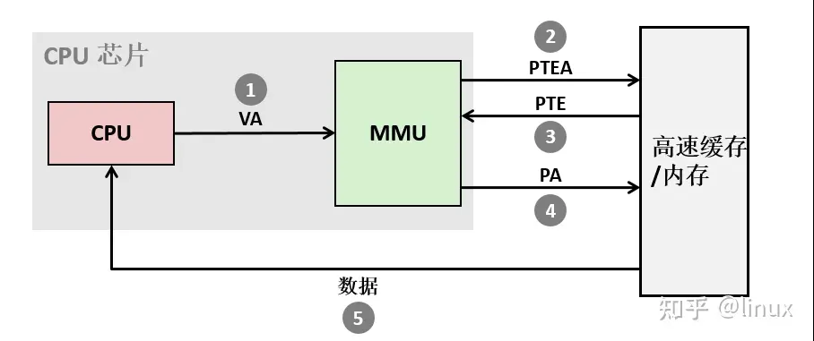
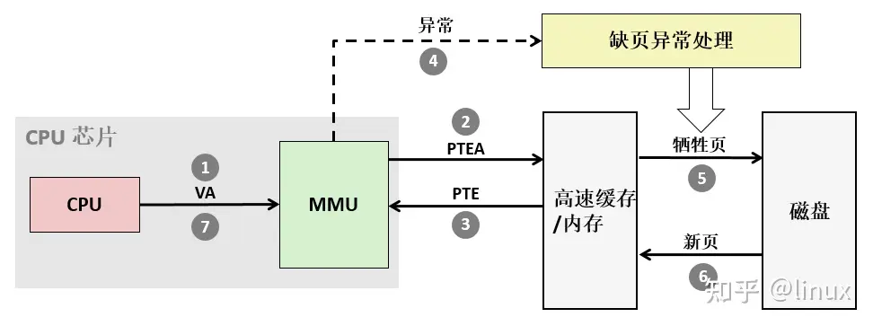

# 页表

## 一、多级页表层次关系

页表基地址的页框里面存的是页目录，页目录对应好多个页表的页框，然后这些页框的页表中放着页表项。

```
CR3（页表基地址，物理页框）
  │
  └──> 页目录（Page Directory, PD）
        ├─ PDE0 → 指向页表页框 PT0
        ├─ PDE1 → 指向页表页框 PT1
        └─ ...
              │
              └──> 页表（Page Table, PT）
                    ├─ PTE0 → 指向物理页框0（存数据）
                    ├─ PTE1 → 指向物理页框1（存数据）
                    └─ ...
```

---

## 二、页表项简化理解

虚拟地址 → 页表项（PTE）：

- 物理地址
- Cache 属性（cacheable / non-cacheable）
- Buffer 属性
- Memory Type（Normal / Device）
- 权限（RW / RO）

---

## 三、PTE 结构（Small Page）

典型 4KB 页映射（最常见）：

```
31                        12  11          0
+---------------------------+-------------+
| 物理页基地址（20 bit）     | 属性位      |
+---------------------------+-------------+
```

`[11:0]` 属性字段（简化说明）：

| 位 | 含义 |
|----|------|
| XN | 是否可执行 |
| AP | 访问权限（读/写） |
| TEX | Memory Type 扩展 |
| C, B | Cache / Buffer |
| S | 是否共享 |
| nG | 是否全局 |

---

## 四、LPAE（Large Physical Address Extension）

如果启用（ARMv7-A 可选）：

- 页表项会变成 **64 位（8 字节）**
- 用于支持 >4GB 内存
- 更复杂的权限模型

---

## 五、页表常用术语

| 术语 | 说明 |
|------|------|
| 页表（page tables） | 虚拟地址与物理地址的对应表集合，存储在主存中 |
| 页表条目（PTE） | 虚拟地址与物理地址具体对应记录，由有效位和地址字段组成 |
| 页命中 | 虚拟地址对应的页在物理内存中，MMU 直接转换成功 |
| 缺页 | 虚拟地址对应的页不在物理内存中，触发缺页异常 |

---

## 六、页命中流程



1. 处理器产生一个虚拟地址
2. MMU 生成 PTE 地址，并从高速缓存/主存请求得到它
3. 高速缓存/主存向 MMU 返回 PTE
4. MMU 构造物理地址，并把它传送给高速缓存/主存
5. 高速缓存/主存返回所请求的数据字给处理器

---

## 七、缺页流程



1. 处理器产生一个虚拟地址
2. MMU 生成 PTE 地址，并从高速缓存/主存请求得到它
3. 高速缓存/主存向 MMU 返回 PTE
4. PTE 中的有效位是零，MMU 触发一次异常，传递 CPU 中的控制到操作系统内核中的缺页异常处理程序
5. 缺页处理程序确定出物理内存中的牺牲页，如果这个页面已经被修改了，则把它换出到磁盘
6. 缺页处理程序页面调入新的页面，并更新内存中的 PTE
7. 缺页处理程序返回到原来的进程，再次执行导致缺页的指令。CPU 将引起缺页的虚拟地址重新发送给 MMU，因为虚拟页面现在缓存在物理内存中，所以就会命中，主存就会将所请求字返回给处理器

---

## 八、置换掉的页去哪了

| 内存页类型 | 去向 |
|-----------|------|
| 干净文件页 | 直接丢弃 |
| 脏文件页 | 写回原文件 |
| 匿名页 | 写入 swap |
| 从未访问过 | 根本没分配 |

---

## 九、DRAM 分类

```
DRAM（动态内存，大类）
  └── SDRAM（同步 DRAM）
        ├── SDR（单倍速）
        └── DDR（双倍速）
              ├── DDR2
              ├── DDR3
              ├── DDR4
              └── LPDDR / GDDR（变种）
```
