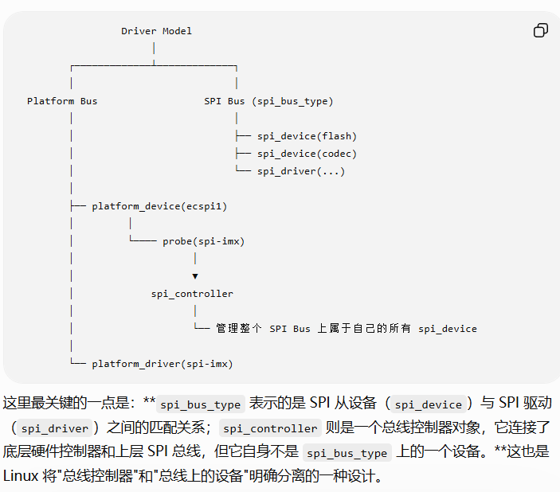
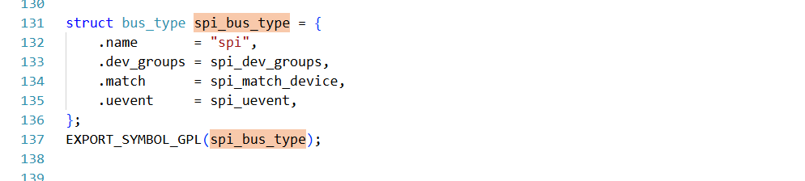
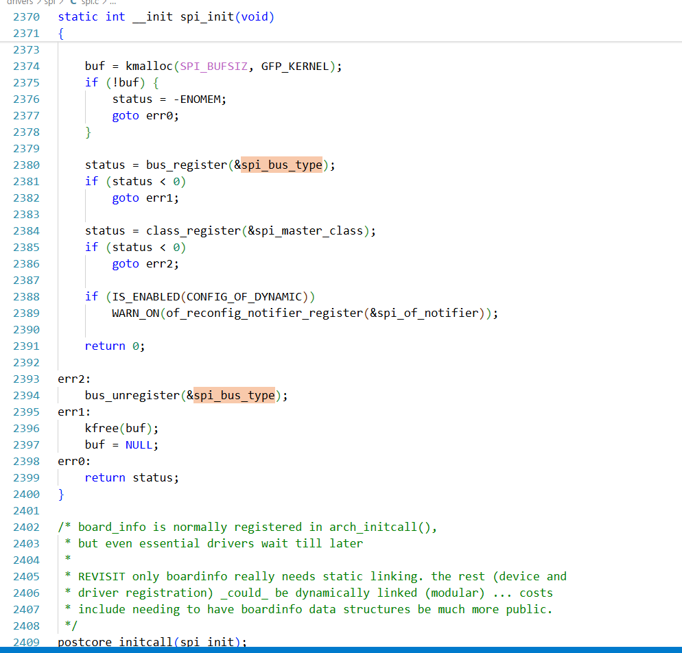

# LINUX总线注册时间

**Linux 内核的实际模型(spi总线）：**

Driver Model

│

┌─────────────┴─────────────┐

│ │

Platform Bus SPI Bus (spi_bus_type)

│ │

│ ├── spi_device(flash)

│ ├── spi_device(codec)

│ └── spi_driver(...)

│

├── platform_device(ecspi1)

│ │

│ └──── probe(spi-imx)

│ │

│ ▼

│ spi_controller

│ │

│ └── 管理整个 SPI Bus 上属于自己的所有 spi_device

│

└── platform_driver(spi-imx)

**SPI 总线（spi_bus_type）不是在 SPI 控制器（SPI Master/Controller）probe 时注册的。**

实际上要把几个概念区分开：

1.  bus（总线类型）
2.  controller（SPI控制器）
3.  device（SPI设备）
4.  driver（SPI驱动）

它们注册的时机完全不同。

**一、bus 是什么时候注册的？spi_bus_type只是 SPI Core 管理的一部分。SPI 总线是在SPI 子系统初始化的时候注册的。**Linux 内核启动过程中，大概顺序是start_kernel() ... do_basic_setup() driver_init() do_initcalls()**SPI 子系统（spi.c）有一个 init 函数**，例如（4.x 内核）static int __init spi_init(void){ bus_register(&spi_bus_type); class_register(&spi_master_class); ...}subsys_initcall(spi_init);

**二、为什么这么早注册？**因为 Driver Model 要先知道世界上有一种 bus 叫 SPI以后任何spi_devicespi_driver才能往这个 bus 上挂。就像：bus_register()↓创建了一块停车场↓以后才能停车