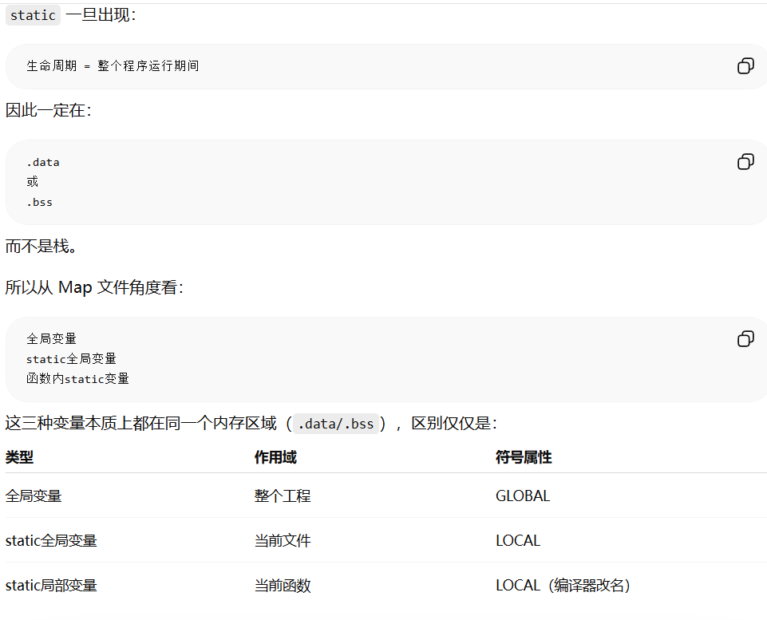

# static 关键字与 const 关键字

## 一、基本原则

- `const` 表示只读输入
- `static` 表示仅当前文件使用（如果确实如此）

这两个警告都是合理的，不是为了"代码好看"，而是为了提高接口的安全性和可维护性。

在 Linux 内核、DSP 算法库、ALSA 驱动里，经验上有个规则：

> 能加 const 就加 const
> 能加 static 就加 static

---

## 二、static 关键字



`static` 用于修饰函数或全局变量时，表示其作用域仅限于当前编译单元（.c 文件），其他文件无法通过 `extern` 引用。

---

## 三、const 关键字

### 函数参数中的 const

```c
short check_frameData_changed(const short *data, short len)
```

意思是：**我承诺不会修改调用者的数据。**

### const 修饰指针指向的数据

```c
const int *p;
// 或者
int const *p;
```

两者完全一样。意思：

- 可以修改 `p`（指针本身）
- 不能修改 `*p`（指向的数据）

例如：

```c
int a = 10;
int b = 20;
const int *p = &a;

p = &b;     // √ 可以
*p = 100;   // × 错误
```

### const short *data 的含义

函数不能修改 data 指向的数据，但可以移动 data 指针本身。

### const 修饰指针本身

```c
int *const p = &a;
```

意思：

- 不能修改 `p`（指针本身）
- 可以修改 `*p`（指向的数据）

---

## 四、总结对照表

| 写法 | 指针本身 | 指向的数据 |
|------|---------|-----------|
| `int *p` | 可修改 | 可修改 |
| `const int *p` / `int const *p` | 可修改 | 不可修改 |
| `int *const p` | 不可修改 | 可修改 |
| `const int *const p` | 不可修改 | 不可修改 |
