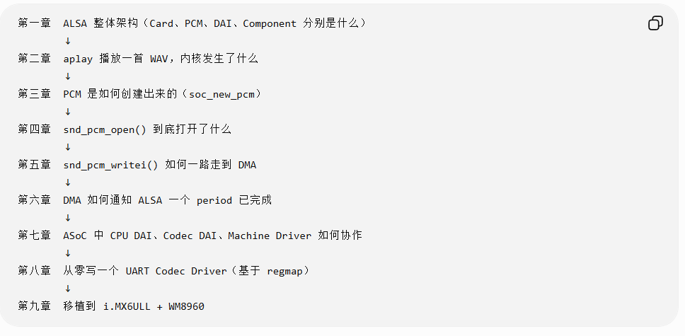
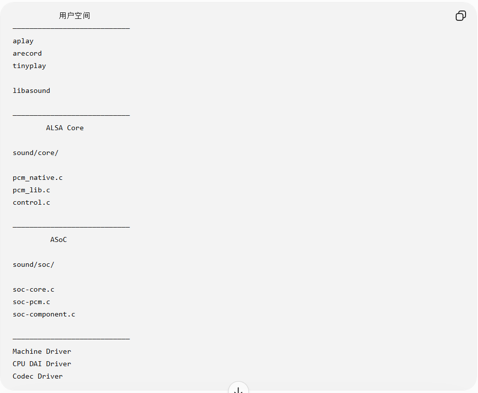
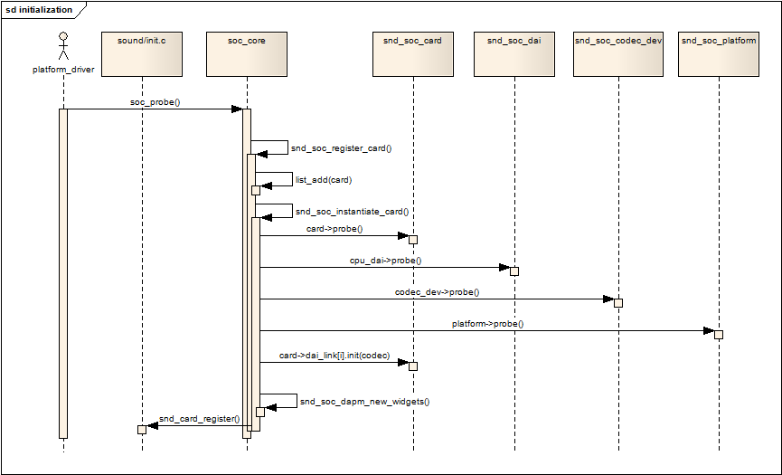

# ALSA 学习路线

## 一、ALSA 分层架构





```
用户空间
────────────────────────────
  aplay / arecord / tinyplay
  libasound
────────────────────────────
  ALSA Core
  sound/core/
  pcm_native.c / pcm_lib.c / control.c
────────────────────────────
  ASoC
  sound/soc/
  soc-core.c / soc-pcm.c / soc-component.c
────────────────────────────
  Machine Driver
  CPU DAI Driver
  Codec Driver
```

---

## 二、参考资料

- [Linux 音频驱动之 ASoC 框架](https://notes.z-dd.online/2021/03/07/Linux%E9%9F%B3%E9%A2%91%E9%A9%B1%E5%8A%A8%E4%B9%8BAsoc%E6%A1%86%E6%9E%B6/index.html)
- [博客园 - ALSA 相关](https://www.cnblogs.com/blogs-of-lxl/p/6538769.html)


