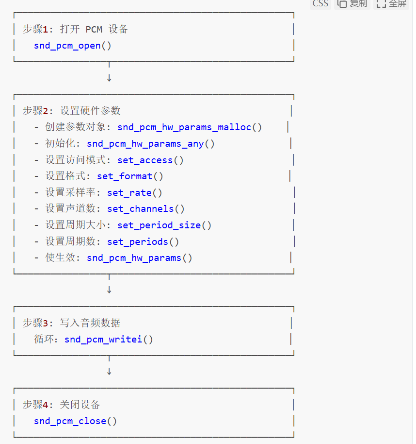

# 音频数据结构层次

https://www.cnblogs.com/blfbuaa/p/19177289

**零、PCM 播放流程**



**示例：**

**设置硬件参数：**

```c
snd_pcm_hw_params_t *hwparams;
snd_pcm_t *pcm;
/* 分配参数对象 */
snd_pcm_hw_params_malloc(&hwparams);
/* 初始化参数对象（获取当前硬件配置） */
snd_pcm_hw_params_any(pcm, hwparams);
/* 设置访问类型：交错模式 */
snd_pcm_hw_params_set_access(pcm, hwparams, SND_PCM_ACCESS_RW_INTERLEAVED);
/* 设置数据格式：有符号16位小端 */
snd_pcm_hw_params_set_format(pcm, hwparams, SND_PCM_FORMAT_S16_LE);
/* 设置采样率：44100 Hz */
unsigned int rate = 44100;
snd_pcm_hw_params_set_rate(pcm, hwparams, rate, 0);
/* 设置声道数：2（立体声） */
snd_pcm_hw_params_set_channels(pcm, hwparams, 2);
/* 设置周期大小：1024 帧 */
snd_pcm_uframes_t period_size = 1024;
snd_pcm_hw_params_set_period_size(pcm, hwparams, period_size, 0);
/* 设置周期数：16 */
unsigned int periods = 16;
snd_pcm_hw_params_set_periods(pcm, hwparams, periods, 0);
/* 使配置生效 */
snd_pcm_hw_params(pcm, hwparams);
/* 释放参数对象 */
snd_pcm_hw_params_free(hwparams);
```

**完整放音示例：**

```c
/***********************************************************
* PCM 播放最简示例
***********************************************************/
#include #include #include int main(void){ snd_pcm_t *pcm; snd_pcm_hw_params_t *hwparams; unsigned char buffer[8192]; snd_pcm_uframes_t period_size = 1024; int ret; /* 1. 打开 PCM 设备 */ ret = snd_pcm_open(&pcm, "default", SND_PCM_STREAM_PLAYBACK, 0); if (ret < 0) { fprintf(stderr, "打开设备失败: %s\n", snd_strerror(ret)); return -1; } /* 2. 设置硬件参数 */ snd_pcm_hw_params_malloc(&hwparams); snd_pcm_hw_params_any(pcm, hwparams); snd_pcm_hw_params_set_access(pcm, hwparams, SND_PCM_ACCESS_RW_INTERLEAVED); snd_pcm_hw_params_set_format(pcm, hwparams, SND_PCM_FORMAT_S16_LE); snd_pcm_hw_params_set_rate(pcm, hwparams, 44100, 0); snd_pcm_hw_params_set_channels(pcm, hwparams, 2); snd_pcm_hw_params_set_period_size(pcm, hwparams, period_size, 0); snd_pcm_hw_params_set_periods(pcm, hwparams, 16, 0); ret = snd_pcm_hw_params(pcm, hwparams); if (ret < 0) { fprintf(stderr, "设置参数失败: %s\n", snd_strerror(ret)); snd_pcm_hw_params_free(hwparams); snd_pcm_close(pcm); return -1; } snd_pcm_hw_params_free(hwparams); /* 3. 循环写入数据 */ while (1) { // 从文件或其他来源读取音频数据到 buffer // read_audio_data(buffer, period_size * 4); ret = snd_pcm_writei(pcm, buffer, period_size); if (ret < 0) { fprintf(stderr, "写入失败: %s\n", snd_strerror(ret)); break; } } /* 4. 关闭设备 */ snd_pcm_drain(pcm); snd_pcm_close(pcm); return 0;}
```

完整异步播放示例：

```c
/***********************************************************
* PCM 异步播放示例
***********************************************************/
#include #include #include #include static snd_pcm_t *pcm;static unsigned char *buffer;static snd_pcm_uframes_t period_size = 1024;static int fd;/* 异步回调函数 */void playback_callback(snd_async_handler_t *handler){ snd_pcm_t *handle = snd_async_handler_get_pcm(handler); snd_pcm_sframes_t avail; int ret; avail = snd_pcm_avail_update(handle); while (avail >= period_size) { ret = read(fd, buffer, period_size * 4); if (ret <= 0) return; snd_pcm_writei(handle, buffer, period_size); avail = snd_pcm_avail_update(handle); }}int main(int argc, char *argv[]){ snd_pcm_hw_params_t *hwparams; snd_async_handler_t *async_handler; sigset_t sset; int ret; /* 屏蔽 SIGIO */ sigemptyset(&sset); sigaddset(&sset, SIGIO); sigprocmask(SIG_BLOCK, &sset, NULL); /* 打开音频文件 */ fd = open(argv[1], O_RDONLY); /* 打开 PCM 设备并设置参数（省略，同前面） */ // ... /* 分配缓冲区 */ buffer = malloc(period_size * 4); /* 注册异步回调 */ snd_async_add_pcm_handler(&async_handler, pcm, playback_callback, NULL); /* 初始填充缓冲区 */ snd_pcm_sframes_t avail = snd_pcm_avail_update(pcm); while (avail >= period_size) { read(fd, buffer, period_size * 4); snd_pcm_writei(pcm, buffer, period_size); avail = snd_pcm_avail_update(pcm); } /* 取消 SIGIO 屏蔽，开始异步播放 */ sigprocmask(SIG_UNBLOCK, &sset, NULL); printf("异步播放中...按回车键退出\n"); getchar(); /* 清理 */ sigprocmask(SIG_BLOCK, &sset, NULL); snd_pcm_close(pcm); free(buffer); close(fd); return 0;}
```

**完整录音示例：**

```c
/***********************************************************
* PCM 录音最简示例
***********************************************************/
#include #include #include #include #include int main(int argc, char *argv[]){ snd_pcm_t *pcm; snd_pcm_hw_params_t *hwparams; unsigned char buffer[8192]; snd_pcm_uframes_t period_size = 1024; int fd, ret; if (argc != 2) { printf("用法: %s <输出文件>\n", argv[0]); return -1; } /* 打开输出文件 */ fd = open(argv[1], O_WRONLY | O_CREAT | O_TRUNC, 0644); if (fd < 0) { perror("打开文件失败"); return -1; } /* 1. 打开 PCM 设备（录音） */ ret = snd_pcm_open(&pcm, "hw:0,0", SND_PCM_STREAM_CAPTURE, 0); if (ret < 0) { fprintf(stderr, "打开设备失败: %s\n", snd_strerror(ret)); close(fd); return -1; } /* 2. 设置硬件参数 */ snd_pcm_hw_params_malloc(&hwparams); snd_pcm_hw_params_any(pcm, hwparams); snd_pcm_hw_params_set_access(pcm, hwparams, SND_PCM_ACCESS_RW_INTERLEAVED); snd_pcm_hw_params_set_format(pcm, hwparams, SND_PCM_FORMAT_S16_LE); snd_pcm_hw_params_set_rate(pcm, hwparams, 44100, 0); snd_pcm_hw_params_set_channels(pcm, hwparams, 2); snd_pcm_hw_params_set_period_size(pcm, hwparams, period_size, 0); snd_pcm_hw_params_set_periods(pcm, hwparams, 16, 0); snd_pcm_hw_params(pcm, hwparams); snd_pcm_hw_params_free(hwparams); printf("开始录音...（按 Ctrl+C 停止）\n"); /* 3. 循环读取数据 */ while (1) { ret = snd_pcm_readi(pcm, buffer, period_size); if (ret < 0) { fprintf(stderr, "读取失败: %s\n", snd_strerror(ret)); break; } /* 写入文件 */ write(fd, buffer, ret * 4); // 16位双声道 = 4字节/帧 } /* 4. 关闭 */ snd_pcm_close(pcm); close(fd); printf("录音完成！\n"); return 0;}
```