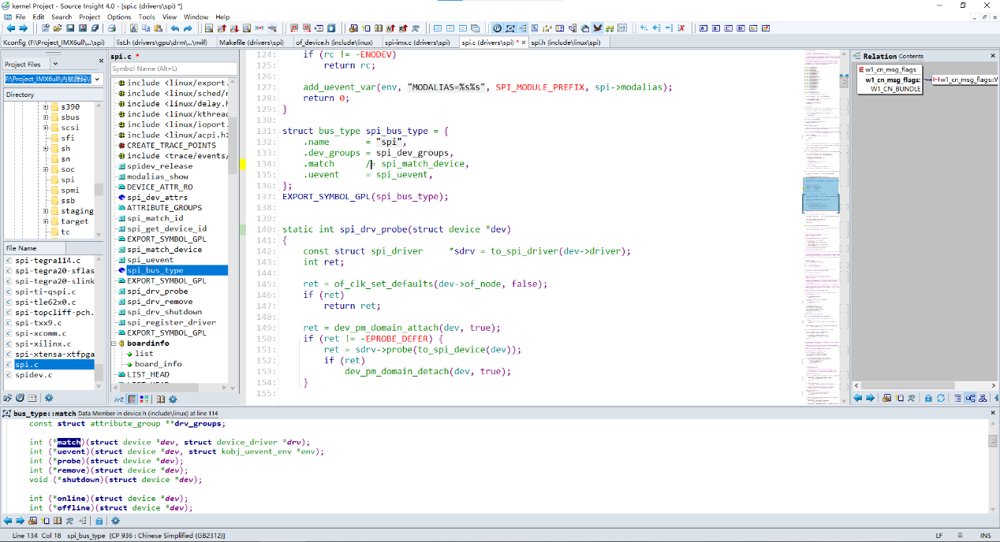

# Source Insight 使用方法

> 参考：[Source Insight 使用教程](https://blog.csdn.net/mjy520123/article/details/120297021)

---

## 一、更改所有文件的编码

1. 菜单栏中 **【Options】** → **【Preferences】** → **File** 标签
2. 最下面的 "**Default encoding**" 选项
3. 选择 "**Chinese Simplified（GB2312）CP:936**"（简体中文）

---

## 二、快捷键修改

**Options → Key Assignments**

例如：`Go back` 改成 `alt + ←`

### 注释快捷键

- `Edit: Comment Lines` — 注释行
- `Edit: Un-Comment Lines` — 取消注释

---

## 三、显示行号

**View → Line Numbers**

---

## 四、设置统一字体大小

1. **View → Mono Font View**
2. **改字体：Options → Preference → Set All Panel Fonts & Colors → Font...**
   - 字体：`consolas`
   - 大小：小四

---

## 五、自动高亮引用

单击某变量或者函数后，自动高亮显示所有引用：

**Options → File Type Options → 勾选 "Highlight references to selected symbol"**
