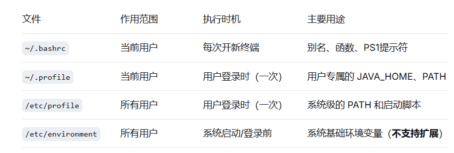

# 编译 imx6ull Linux 应用 app

## 一、环境安装

### 1. 下载

去 [Linaro 官网](https://www.linaro.org/) 下载适合 64 位系统的版本，例如：

```
gcc-linaro-7.5.0-2019.12-x86_64_arm-linux-gnueabihf.tar.xz
```

### 2. 解压（假设放到 /usr/local/arm）

```bash
sudo mkdir -p /usr/local/arm
sudo tar -xvf gcc-linaro-7.5.0-2019.12-x86_64_arm-linux-gnueabihf.tar.xz -C /usr/local/arm/
```

### 3. 配置并验证环境变量

为了让编译器随时可用，将 bin 目录加入环境变量：

```bash
export PATH=$PATH:/usr/local/arm/gcc-linaro-7.5.0-2019.12-x86_64_arm-linux-gnueabihf/bin
```

### 永久加入环境变量

| 文件 | 级别 | 说明 |
|------|------|------|
| `~/.bashrc` | 用户级 | 最稳妥，只影响终端 |
| `~/.profile` / `~/.bash_profile` | 用户级登录脚本 | 不建议动，可能影响桌面环境 |
| `/etc/profile` / `/etc/environment` | 系统级全局 | 影响所有用户 |

> 建议：直接在 `~/.bashrc` 末尾添加（最稳妥，只影响终端）。



### 4. 生效并验证

```bash
arm-linux-gnueabihf-gcc -v
```

### 5. 若使用 Makefile 则需

```bash
export ARCH=arm
export CROSS_COMPILE=arm-linux-gnueabihf-
export PATH=$PATH:/your/toolchain/bin
```

---

## 二、编译 app 标准指令

```bash
${CC} -o testApp testApp.c -Ixxx -Lyyy -lzzz
```

- `xxx`：头文件的路径
- `yyy`：库文件的路径
- `zzz`：链接库

---

## 三、编译示例

```bash
arm-linux-gnueabihf-gcc hello.c -o hello
```

```bash
arm-linux-gnueabihf-gcc -std=gnu99 \
    --sysroot=/opt/fsl-imx-x11/4.1.15-2.1.0/sysroots/cortexa7hf-neon-poky-linux-gnueabi \
    -o playAndRecoed playAndRecoed.c -lpthread -lasound
```

---

## 四、使用 ssh 拷贝到开发板

```bash
scp helloworld root@192.168.55.71:/home/root/
scp audioApp root@192.168.55.71:/home/root/
scp playAndRecoed root@192.168.55.71:/home/root/
```

---

## 五、在开发板上执行

```bash
chmod +x audioApp
./audioApp
```

---

## 六、验证文件架构

使用 `file` 命令查看文件属性，确认它确实是 ARM 架构：

```bash
file helloworld
```
