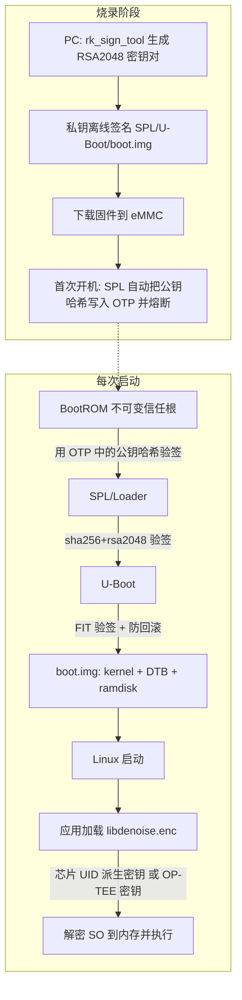

# RK3568 安全启动 + SO 库芯片绑定：完整正确流程

> 适用平台：RK3568（Rockchip RK3568，FIT 方案 + OTP）
> 依据：Rockchip《Linux Secure Boot 开发指南》V4.0.0、Rockchip《RK356X SecurityBoot 和 AVB 操作指南》V1.2.0、RK3568 Datasheet
> 说明：本文是 RK3568 上安全启动 + SO 库芯片绑定的**完整正确流程**，命令可直接照着执行（以你的 SDK 版本为准微调路径）。

---

## 0. 这套方案解决什么

```
目标 1：防止固件被篡改（Secure Boot）
  芯片只允许启动"用你的私钥签名过的固件"，别人改一个字都起不来。

目标 2：防止 SO 库被拷走换板使用（芯片绑定）
  libdenoise.so 加密发布，且解密密钥与单块芯片绑定，
  拷到另一块板上解密失败（或根本解不出正确 DEK）。

目标 3（可选）：试用期时间控制
  无硬件安全时钟，用"外部 RTC + 防回拨 + TEE 存储授权状态"近似实现。
```

整体信任链如下：



---

## 1. 前置准备

| 项目 | 要求 |
|---|---|
| 开发机 | Ubuntu 18.04/20.04 x86_64 |
| SDK | 提供的 Linux SDK（含 rkbin、u-boot、kernel、buildroot） |
| 工具 | rkbin/tools/rk_sign_tool、openssl、device-tree-compiler（fdtput ≥ 1.4.5） |
| 硬件 | RK3568 开发板，OTP 供电正常（核心板默认已接好） |
| 烧写 | Windows 用 AndroidTool；Linux 用 upgrade_tool |

检查 fdtput 版本（过低会导致打包失败）：

```bash
fdtput --version
# 期望输出: Version: DTC 1.4.5 或更高
# 不够就装: sudo apt-get install device-tree-compiler
```

> ⚠️ **重要**：Secure Boot 一旦熔断**不可撤销**。建议先在普通开发板上走通全部流程、验证无误后，再对量产板执行第 4 步的熔断。

---

## 2. 阶段一：生成安全启动密钥（只做一次）

在 SDK 的 `u-boot/` 目录下执行：

```bash
cd u-boot

# 1. 创建 keys 目录
mkdir -p keys

# 2. 用 Rockchip 工具生成 RSA-2048 密钥对
../rkbin/tools/rk_sign_tool kk --bits 2048 --out .

# 生成的文件: privateKey.pem（私钥）、publicKey.pem（公钥）
# 3. 放到 U-Boot 指定的固定位置（名字不可改，its 文件里写死了）
ln -s privateKey.pem keys/dev.key
ln -s publicKey.pem keys/dev.pubkey

# 4. 用私钥生成自签名证书（等价于公钥，打包时要用）
openssl req -batch -new -x509 -key keys/dev.key -out keys/dev.crt
```

生成结果：

```bash
ls -l keys/
# dev.crt  dev.key  dev.pubkey
```

如果报错 `Can't load /home/xxx/.rnd into RNG`，执行一次 `touch ~/.rnd` 再重试。

> 🔐 **私钥 = 命根子**。`dev.key` 一旦泄露，攻击者可以给你的固件"合法签名"，Secure Boot 形同虚设。请离线加密保管，绝不进 Git 仓库、绝不发给工厂以外的人。
>
> 说明：这里的 `dev.key / dev.pubkey / dev.crt` 三件套是 U-Boot FIT 签名体系的固定要求——**一把 RSA 公钥**被打包进 SPL，其哈希随后烧进 OTP（见第 4 节）。

---

## 3. 阶段二：配置并编译签名固件

### 3.1 打开安全启动配置

编辑 `configs/rk3568_defconfig`：

```bash
vim configs/rk3568_defconfig
```

添加（RK3566 和 RK3568 都改这个文件）：

```makefile
# 必选：FIT 签名校验
CONFIG_FIT_SIGNATURE=y
CONFIG_SPL_FIT_SIGNATURE=y

# 可选：防版本回滚（建议开启）
CONFIG_FIT_ROLLBACK_PROTECT=y          # boot.img 防回滚
CONFIG_SPL_FIT_ROLLBACK_PROTECT=y      # uboot.img 防回滚
```

> 建议用 `make menuconfig` 勾选后再 `make savedefconfig` 更新 defconfig，避免依赖关系不全导致编译失败。

### 3.2 编译并签名（关键命令）

```bash
# 以 RK3568 为例（RK3566 把 rk3568 换成 rk3566）
./make.sh rk3568 --spl-new \
    --boot_img boot.img \
    --recovery_img recovery.img \
    --rollback-index-uboot 1 \
    --rollback-index-boot 2 \
    --burn-key-hash
```

参数含义：

| 参数 | 作用 |
|---|---|
| `--spl-new` | 用当前编译的 SPL 打包 loader。**必加**：因为 SPL 里要内嵌你的公钥，官方 rkbin 仓库不会提交带安全启动的 SPL |
| `--boot_img boot.img` | 指定待签名的 boot.img（kernel + DTB + ramdisk） |
| `--recovery_img recovery.img` | 指定待签名的 recovery.img（没有可去掉） |
| `--rollback-index-uboot 1` | uboot.img 最小版本号 = 1（防回滚） |
| `--rollback-index-boot 2` | boot.img 最小版本号 = 2 |
| `--burn-key-hash` | **首次开机时 SPL 自动把公钥哈希写入 OTP 并熔断** |

编译正常时的关键输出：

```text
### spl/u-boot-spl.dtb: burn-key-hash=1
start to sign rk3568_spl_loader_v1.x.bin
sign loader ok.
Image(signed, version=0, rollback-index=1): uboot.img (FIT with uboot, trust...) is ready
Image(signed, version=0, rollback-index=2): boot.img (FIT with kernel, fdt, resource...) is ready
```

编译产物（三个已签名镜像）：`loader.bin`、`uboot.img`、`boot.img`。
只要 RSA 密钥不换，这三个镜像之后**可以单独更新**（重新签名后单独烧写）。

> 🔧 **调试建议**：开发阶段先**不要加 `--burn-key-hash`**（否则第一次开机 OTP 就熔断了，之后换密钥就废板）。
> 流程：先不加 burn-key-hash 编译验证签名链路 → 确认一切正常 → 最后才加 `--burn-key-hash` 做量产镜像。

### 3.3 只重签 boot.img（后续内核更新）

之后每次只改内核，无需重新编译 U-Boot，单独重签 boot.img 即可：

```bash
./make.sh rk3568 --spl-new
./scripts/fit.sh --boot_img boot.img        # 单独签名 boot.img
```

---

## 4. 阶段三：烧录 + OTP 熔断

### 4.1 下载固件

- Windows：AndroidTool（RKDevTool）按分区烧写 `loader.bin / uboot.img / boot.img`；
- Linux：`upgrade_tool` 同理；
- 也可以直接烧完整 `update.img`（量产时用工厂工具）。

### 4.2 首次开机自动熔断

RK3568 用的是片上 **OTP**（一次性可编程存储）：

> 依据官方指南："直接通过 AndroidTool(Windows)/upgrade_tool(Linux) 下载固件，**第一次重启，Loader 会负责将 Key 的 Hash 写入 OTP**，激活 Secure Boot。再次重启，固件就处于保护中了。"

也就是说：**不需要**任何外部烧录工具——烧录动作是打包进固件的，第一次重启时 SPL 自动完成。前提是 OTP 供电正常（核心板默认满足）。

首次熔断时的串口 log 能看到：

```text
# SecureCheckHeader 0, 0, 0
# SecureWriteOTP
# enable secure flag!
# otp write key success!!
SecureInit ret = 0, SecureMode = 1
```

### 4.3 验证是否生效

再次重启，串口 log 中 SPL 阶段应看到：

```text
## Verified-boot: 1          # 1 = 已熔断（0 = 未熔断）
sha256, rsa2048:dev+         # SPL 签名校验通过
rollback index: 1 >= 0(min), OK   # 防回滚检查通过
### Checking atf-1 ... sha256+ OK
### Checking uboot ... sha256+ OK
### Checking fdt ... sha256+ OK
```

U-Boot 阶段验证 boot.img：

```text
### Loading kernel from FIT Image at 3d8122c0 ...
Verifying Hash Integrity ... sha256, rsa2048:dev+ OK
Verifying Rollback-index ... 2 >= 1, OK
```

**验证手段**：把任意一个分区换成未签名的镜像（比如随便改一下 boot.img 再烧），如果芯片拒绝启动、卡在 SPL，说明 Secure Boot 生效。

### 4.4 OTP 特性速查

| 项目 | RK3568 OTP |
|---|---|
| 容量 | 8K bit（1KB），其中 7K bit 供安全应用 |
| 写入方式 | Loader/SPL 在首次开机时写入（或 maskrom 阶段），无外部工具 |
| 读取 | **可读**（Read 模式），但只允许 A55 安全模式访问 |
| 改写 | 一次性，熔断后不可改 |
| 用途 | 公钥哈希 + 安全标志位 |

> ⚠️ 官方指南明确提醒：**OTP 空间主要由 Rockchip 内部使用，客户自定义安全信息请优先存 RPMB/Security 分区**。所以"把 AES 密钥烧进 OTP"在 RK3568 上**不是推荐做法**——RPMB（eMMC 安全分区）才是放密钥的地方（见第 6 节）。

---

## 5. 阶段四：SO 库芯片绑定（核心设计）

### 5.1 设计：DEK 包装（密钥信封）方案

直接加密 SO 的两种常见错误设计：
1. **所有芯片用同一把 AES 密钥** → SO 拷到同型号其他板子照样解密，芯片绑定失效；
2. **密钥直接存 OTP** → RK3568 OTP 空间宝贵且官方不推荐客户占用。

正确做法是 **DEK（Data Encryption Key）包装**（密钥信封方案）：

```
概念：
  DEK      = 随机生成的一把 AES-256 密钥，负责加密 SO（所有芯片用同一份密文）
  ChipKey  = 每块芯片独有的密钥，负责加密 DEK

文件结构（随固件发布）：
  libdenoise.enc           = AES-GCM(DEK, libdenoise.so)      ← 全芯片共用同一份
  dek.enc                  = AES-GCM(ChipKey, DEK)             ← 每块芯片不同

运行时：
  芯片读自己的 UID → 派生 ChipKey → 解开 dek.enc 得到 DEK → 解开 libdenoise.enc
  → 明文进内存 → dlopen 执行
```

效果：
- 攻击者把 `libdenoise.enc + dek.enc` 拷到另一块板 → 那板的 UID 不同 → ChipKey 不同 → `dek.enc` 解出乱码 → 失败；
- 即使拿到所有密文文件，没有对应芯片，也还原不出明文。

### 5.2 第一步：读取芯片 UID

RK3568 每块芯片有唯一 ID（CPUID，存于 OTP，软件可读，由 SDK 的 efuse/otp 驱动导出）。在板子上：

```bash
# 方法一：nvmem sysfs（RK SDK 默认开启 CONFIG_ROCKCHIP_OTP / CONFIG_ROCKCHIP_EFUSE）
cat /sys/bus/nvmem/devices/rockchip-otp0/nvmem | xxd -p
# 或
cat /sys/bus/nvmem/devices/rockchip-efuse0/nvmem | xxd -p

# 方法二：读 /proc/device-tree/serial-number（部分 SDK 会导出）
cat /proc/device-tree/serial-number
```

> 输出形如 `4c0000a2xxxxxxxxxxxxxxxxxxxxxxxxxxxxxxxxxxxxxxxxxxxxxxxxxxxxxxxxxxxxxxxx`（前 4 字节是批次信息，后面才是 UID）。**UID 的具体字节偏移以你的 SDK/TRM 为准**——本文按"取 16 字节 UID"处理。做产品时先在产测脚本里固化好偏移。

### 5.3 第二步：加密（产线 PC 上执行）

```bash
# ① 随机生成 DEK（256 位，一次性生成，妥善保存）
DEK=$(openssl rand -hex 32)
echo "DEK=$DEK" > dek.master          # 绝密，只保存在产线安全机器上

# ② 用 DEK 加密 SO（全芯片共用这一份密文）
#    生产建议 AES-256-GCM（带认证）；openssl 命令行做 GCM 较繁琐，
#    此处用 CBC 演示结构，产品代码里请用 EVP 的 GCM 接口（见 5.5）
openssl enc -aes-256-cbc -K $DEK -iv 00000000000000000000000000000000 \
    -in libdenoise.so -out libdenoise.enc

# ③ 读取当前这块芯片的 UID（从板子抄回来）
UID_HEX=xxxxxxxxxxxxxxxxxxxxxxxxxxxxxxxx    # 例：128bit UID 的 hex

# ④ 由 UID 派生 ChipKey（KDF = SHA256(UID || 固定盐)）
SALT="zhengyuan-atomic-rk3568-v1"          # 固定盐，写死在代码里
CHIP_KEY=$(echo -n "${UID_HEX}${SALT}" | sha256sum | cut -d' ' -f1)
# CHIP_KEY 就是 32 字节 = AES-256 密钥

# ⑤ 用 ChipKey 加密 DEK（每块芯片生成一份 dek.enc）
#    注意：DEK 先转回 32 字节二进制再加密，保证与运行时 C 代码的格式一致
echo -n $DEK | xxd -r -p | openssl enc -aes-256-cbc -K $CHIP_KEY \
    -iv 00000000000000000000000000000000 -out dek.enc

# ⑥ 把 libdenoise.enc（通用）+ dek.enc（本芯片专属）烧入本芯片对应的设备
```

产线流程示意：

```
┌─────────────┐   ① 读 UID    ┌──────────────┐   ② 派生 ChipKey    ┌──────────────┐
│ 待产设备     │ ───────────► │ 产测 PC       │ ─────────────────► │ 生成 dek.enc  │
│ (RK3568)    │              │ (跑脚本)      │                    └──────┬───────┘
└─────────────┘              └──────────────┘                           │ ③ 与通用
                                                                        │  libdenoise.enc
                                                                        ▼ 一起写入设备
```

### 5.4 第四步：运行时解密加载（设备端 C 代码）

```c
/* app_loader.c —— 用 OpenSSL EVP 实现，结构示意 */
#define _GNU_SOURCE        /* memfd_create 需要 */
#include <openssl/evp.h>
#include <openssl/sha.h>
#include <fcntl.h>
#include <unistd.h>
#include <stdio.h>
#include <stdlib.h>
#include <string.h>
#include <sys/mman.h>
#include <dlfcn.h>

#define UID_LEN    16      /* UID 长度，按 TRM 定 */
#define UID_OFFSET 0x40    /* UID 在 OTP 中的字节偏移，以你的 TRM 为准 */
#define SALT       "zhengyuan-atomic-rk3568-v1"

/* 1) 读芯片 UID（nvmem sysfs） */
int read_chip_uid(unsigned char *uid) {
    int fd = open("/sys/bus/nvmem/devices/rockchip-otp0/nvmem", O_RDONLY);
    if (fd < 0) return -1;
    if (lseek(fd, UID_OFFSET, SEEK_SET) < 0) { close(fd); return -1; }
    ssize_t n = read(fd, uid, UID_LEN);   /* 定位到 UID 区再读 */
    close(fd);
    return (n == UID_LEN) ? 0 : -1;
}

/* 2) KDF: ChipKey = SHA256(UID || SALT) */
void derive_chip_key(const unsigned char *uid, unsigned char *key32) {
    EVP_MD_CTX *ctx = EVP_MD_CTX_new();
    EVP_DigestInit_ex(ctx, EVP_sha256(), NULL);
    EVP_DigestUpdate(ctx, uid, UID_LEN);
    EVP_DigestUpdate(ctx, SALT, strlen(SALT));
    unsigned int len = 0;
    EVP_DigestFinal_ex(ctx, key32, &len);
    EVP_MD_CTX_free(ctx);
}

/* 3) AES-256-GCM 解密：dek.enc -> DEK；libdenoise.enc -> 明文 */
int aes_gcm_decrypt(const unsigned char *key, const unsigned char *iv,
                    const unsigned char *ct, size_t ct_len,
                    const unsigned char *tag, unsigned char *pt) {
    EVP_CIPHER_CTX *ctx = EVP_CIPHER_CTX_new();
    int len = 0, total = 0;
    EVP_DecryptInit_ex(ctx, EVP_aes_256_gcm(), NULL, NULL, NULL);
    EVP_CIPHER_CTX_ctrl(ctx, EVP_CTRL_GCM_SET_IVLEN, 12, NULL);
    EVP_DecryptInit_ex(ctx, NULL, NULL, key, iv);
    EVP_DecryptUpdate(ctx, pt, &len, ct, ct_len);
    total = len;
    EVP_CIPHER_CTX_ctrl(ctx, EVP_CTRL_GCM_SET_TAG, 16, (void*)tag);
    if (EVP_DecryptFinal_ex(ctx, pt + total, &len) <= 0) return -1; /* 认证失败 */
    EVP_CIPHER_CTX_free(ctx);
    return total + len;
}

/* 4) 解密到 memfd，再 dlopen（明文不落盘） */
void *load_denoise(void) {
    unsigned char uid[UID_LEN], chip_key[32], dek[32];
    read_chip_uid(uid);
    derive_chip_key(uid, chip_key);

    /* 读入 dek.enc、libdenoise.enc（含 GCM 的 tag/iv 布局，按你的格式解析） */
    aes_gcm_decrypt(chip_key, iv_dek, dek_enc, dek_enc_len, tag_dek, dek);

    int fd = memfd_create("denoise", 0);           /* 匿名内存文件 */
    unsigned char *so_buf = malloc(SO_LEN);
    aes_gcm_decrypt(dek, iv_so, so_enc, so_enc_len, tag_so, so_buf);
    write(fd, so_buf, SO_LEN);

    /* dlopen 不接受 fd 参数，必须通过 /proc/self/fd/N 路径加载 memfd 中的库 */
    char path[64];
    snprintf(path, sizeof(path), "/proc/self/fd/%d", fd);
    void *h = dlopen(path, RTLD_NOW | RTLD_LOCAL);
    return h;
}
```

要点：
- 明文 SO **只在内存**（memfd），不落盘；
- 用 **AES-256-GCM**：带认证标签，密文被篡改直接解密失败（CBC 没有这个能力）；
- IV 每次随机，随密文一起存（12 字节 GCM 标准 IV）。

### 5.5 诚实说明：这个方案的边界

| 威胁 | 能否防住 |
|---|---|
| 直接把加密文件拷到另一块板 | ✅ 能，UID 不同解不出 |
| 修改密文文件 | ✅ 能，GCM 认证失败 |
| root 用户 dump 运行时的内存明文 | ❌ 不能（明文在用户态内存） |
| 攻击者拿到 UID + 逆向出 KDF 算法 | ❌ 不能（UID 可读，算法在代码里） |

结论：**UID 派生方案 = 防"拷文件"级保护**。如果对手会逆向，要上第 6 节的 OP-TEE 方案，把密钥和解密放进安全世界。

---

## 6. 阶段五（可选，防逆向级）：OP-TEE KeyBox / RPMB

要防 root dump，就把密钥放进**安全世界（TrustZone）**，让 Linux 用户态永远接触不到：

- 密钥存在 **RPMB**（eMMC 安全分区，只能由 TEE 访问，内容加密存放）或 Security 分区；
- Rockchip SDK 自带 **KeyBox** 实例（`buildroot/package/rockchip/tee-user-app`），用于 TEE 内的密钥管理：
  - **CA**（`keybox_app`）：运行在 Linux 用户态，向 TEE 发起请求；
  - **TA**（`.ta` 文件）：运行在安全世界，真正读写 RPMB 里的密钥；
- 官方对 KeyBox 的安全建议：
  - 必须搭配 FIT/AVB 安全方案使用；
  - **TA 文件要签名**（见 TEE SDK 文档第 5 章），防止第三方在你机器上运行自定义 TA；
  - 默认代码限制"只能在 Ramdisk 中、PID=1 的程序里读 Key"，防止 CA 被拷出去用。

启用 KeyBox 的关键配置：

```makefile
# buildroot
BR2_PACKAGE_TEE_USER_APP=y
BR2_PACKAGE_TEE_USER_APP_COMPILE_CMD="6432"      # 64 位 CA + 32 位 TA
BR2_PACKAGE_TEE_USER_APP_TEE_VERSION="v2"

# kernel
CONFIG_TEE=y
CONFIG_OPTEE=y
```

```dts
optee: optee {
    compatible = "linaro,optee-tz";
    method = "smc";
    status = "okay";
};
```

配套的 **System-Encryption**（整个系统分区加密，dm-crypt + LUKS 风格）：密钥先放在 misc.img 随固件下发，Ramdisk 首次启动时读取密钥写入 RPMB 并清空 misc.img，之后系统分区由内核 Device-Mapper 实时解密——这正是官方推荐的"客户密钥放 RPMB"标准路径。

---

## 7. 阶段六（可选）：时间授权

RK3568 **没有**片上硬件安全时钟（防篡改 RTC）。做"30 天试用"的可行替代：

| 方案 | 做法 | 弱点 |
|---|---|---|
| 外部 RTC + 防回拨 | 板载电池 RTC + 保存"上次合法时间"，检测时间倒退就锁定 | 拔电池可重置，需配合防拆 |
| TEE 内授权状态 | 到期时间戳存 RPMB（TEE 签名保护），应用每次问 TEE 要"授权状态"而非直接读系统时间 | 无法防止改 RTC 芯片本身，但改不了 RPMB 里的记录 |
| 联网时间戳 | 首次激活时向服务器取时间戳签名 | 需联网，离线设备不适用 |

务实的组合：**外部 RTC + TEE 存授权状态**，能挡住"改系统时间"这种 99% 的攻击。

---

## 8. 常见错误清单

1. **忘了 `--spl-new`** → 用的还是 rkbin 里的老 SPL，不含你的公钥，验签失败；
2. **调试阶段就加 `--burn-key-hash`** → OTP 熔断后想换密钥，芯片直接废掉；
3. **改动 `keys/` 下三个文件名** → its 文件静态引用，改名打包直接失败；
4. **对 PEM 文本 `sha256sum` 当 OTP 值** → 官方流程根本不让你手动算，交给工具；
5. **所有芯片同一把 AES 密钥** → 芯片绑定失效，必须 DEK 包装 + 每芯片密钥；
6. **密钥写进 OTP** → RK3568 OTP 空间宝贵、且官方不建议客户占用；
7. **CBC + 固定 IV** → 明文模式泄露 + 无完整性，换 GCM；
8. **以为 Secure Boot 能防 root** → 它只防"篡改固件"，不防"运行期 dump 内存"，防逆向要 TEE。

---

## 9. 参考

- Rockchip《Linux Secure Boot 开发指南》V4.0.0（RK-KF-YF-379）：FIT 密钥生成、make.sh 编译、OTP 烧写、KeyBox、System-Encryption
- Rockchip《RK356X SecurityBoot 和 AVB 操作指南》V1.2.0（RK-YH-YF-289）：rk3568_defconfig 配置、`--burn-key-hash`、启动 log 判定
- Rockchip RK3568 Datasheet：OTP 规格（8K bit，7K bit 安全应用，Secure OTP 仅安全模式访问）
- Rockchip《Secure Boot Application Note》V1.9：BootROM 验签 loader 流程

> 本文所有命令以公开官方文档为据；实际以你手里的 SDK 版本为准，路径（rkbin、u-boot）如有差异请对应调整。
