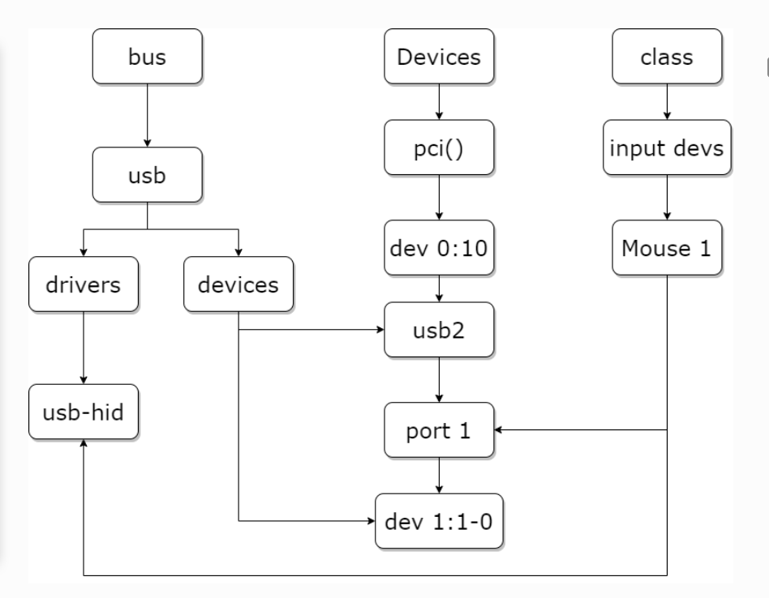

# linux文件目录

**sys：系统暴露出来的控制接口**

**class/**→ 按设备类型组织

**devices/**→ 是 Linux device model 在运行时构建的"设备对象树"，DT 只是其中一个输入来源。这个目录记录了系统中所有设备，实际上在sys目录下所有设备文件最终都会指向该目录对应的设备文件

**dev/**→记录所有的设备节点， 但实际上都是些链接文件，同样指向了devices目录下的文件

**bus/**→ 按总线类型组织（bus_type（类型）并非实例）

**block/**→ 块设备

**module/**→ 内核模块信息

**kernel/**→ 内核全局信息

**firmware/**→ 系统固件信息

**备注：**

/sys/devices/ = "你在哪块板、哪个控制器上"
/sys/devices/pci0000:00/0000:00:1f.2/   # SATA 控制器
/sys/devices/platform/serial8250/ttyS0  # 串口
/sys/bus/ = "你属于哪个总线，哪个驱动负责你"
/sys/bus/<bus>/devices
/sys/bus/<bus>/drivers/

**示例：**

**/proc**

/proc 表示系统运行状态
/proc/device-tree 原始DTB展开的硬件描述，只是"调试/用户态视图"。

**/run**

/run是一个**tmpfs**(临时文件系统) 挂载点，它主要用来存放系统从启动以来所需要的各种**运行时数据**