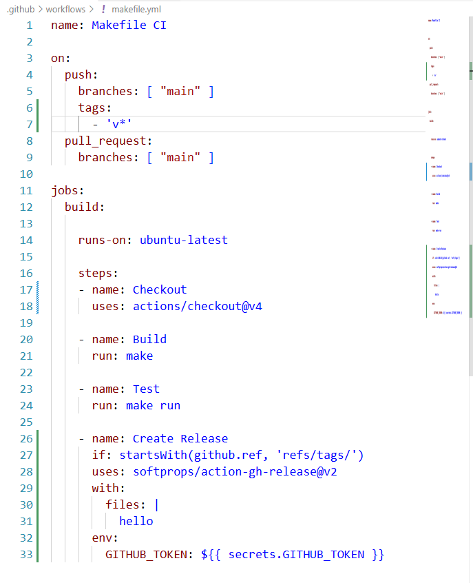

# yml文件讲解

**1、name:Makefile CI ：**CI 代表持续集成（Continuous Integration）

**2、符号-的意思表示：**同一类成员分组（我认为），只有一组时可以省略

**3、build:** 定义了一个任务

**4、runs-on: ubuntu-latest ：**给开一台虚拟机

**5、steps ：** 步骤，按照后面的序列执行

**6、if:startsWith(github.ref, 'refs/tags/') ：** 表示必须有tag触发

**7、env: GITHUB_TOKEN: ${{ secrets.GITHUB_TOKEN }} ：**作用是GitHub Actions自动提供一个token。允许Action创建release上传文件修改仓库内容，不用你手动生成。

**8、uses:actions/checkout@v4 ： 调用别人已经写好的 GitHub Action 插件。**不用自己写"创建 Release、上传附件"的脚本，直接调用一个现成的功能模块。 GitHub Action 本质上就是一个自动化脚本包。

**9：run与use的区别：** run是在Ubuntu虚拟机里面执行命令。 而uses是加载一个别人写好的自动化模块。