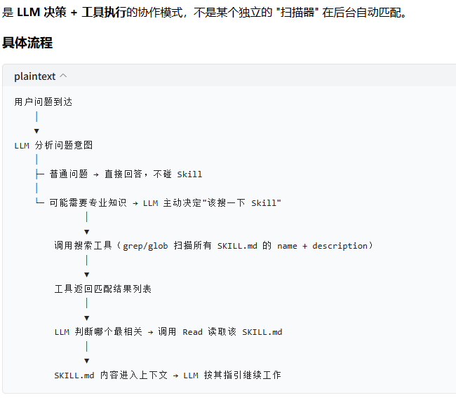

# 智能体运行方式

**Q: Agent主要流程是什么：**

**A:** 人发消息给智能体，智能体把消息和自身技能/工具情况传给大模型，大模型判断要调用哪个技能和工具，生成指令给智能体，智能体再去调工具，工具返回结果后，智能体把结果传给大模型，大模型整理成自然语言，最后由智能体回复给人。复杂任务时，这个过程会重复几次，直到完成任务。

**Q: Agent是执行者，LLM是大脑对吗？**

**A:** 对。例如用户发送帮我查一下北京明天天气，LLM可能输出：{ "tool": "weather_query","arguments": { "city":"北京", "date":"明天" }} ，Agent收到这个指令：调用 weather_query()，随后返回结果，智能体把结果传给大模型，大模型再整理成自然语言输出。复杂任务时，这个过程会重复几次。

**Q: Agent为什么能调用工具？**

**A:** 不是因为Agent像人一样"懂"工具，而是因为它有一个**执行框架**。例如定义了一个工具： def read_file(filename): return open(filename).read() 然后注册：{ "name": "read_file", "description": "读取文件内容", "parameters": { "filename":"string" }} Agent告诉LLM：你可以使用这个工具。LLM看到用户：帮我看看main.c有什么问题。它推理："用户想分析代码需要先获取代码内容可用工具有read_file所以调用read_file"，生成JSON传给Agent，Agent解析执行read_file("main.c");

**Q: Agent也有简单的智能对吗？**

**A:** Agent本身可以有一些"简单智能"，但真正负责推理和决策的通常是里面的大模型（LLM）。
Agent通常有一些非LLM逻辑，例如：任务状态管理、工具选择规则、循环控制。但是复杂情况下，Agent本身不会思考。

**Q: LLM相当于大脑，Agent = 身体 + 手脚 + 工具箱 + 工作流程，工具 = 锤子、电脑、仪器，skills相当于技能说明书对吗？**

**A:** 对，不过不过skills 和 tools 还是有区别的。**Tool（工具）是什么？**Tool是真正能产生外部动作的东西。 **Skill（技能）是什么？**Skill更像完成某类任务的方法论、经验、流程和规则。

**Q: 在进行任务时，智能体每一次都会把 skill.md 夹杂着其他内容和用户问题一起发给 LLM 吗？**

**A:** 不是每轮都重新读取和发送。Skill 的加载是**按需触发 + 上下文缓存**的机制。对这个仓库的意义是，把 linux-driver-development 做成 Skill 仓库后，当用户问 "帮我写一个 I2C 驱动" 时：
1.  系统扫描到 description 匹配 → 读取 SKILL.md
2.  SKILL.md 中的工作流程指引它去读 references/i2c-spi.md
3.  再从 assets/templates/ 复制模板代码
整个过程是**链式按需加载**，不是一次性把所有文件都塞进去。这也是为什么 SKILL.md 要写清楚工作流程和参考文档索引 ------ 它是整个 Skill 的入口和路由表。

